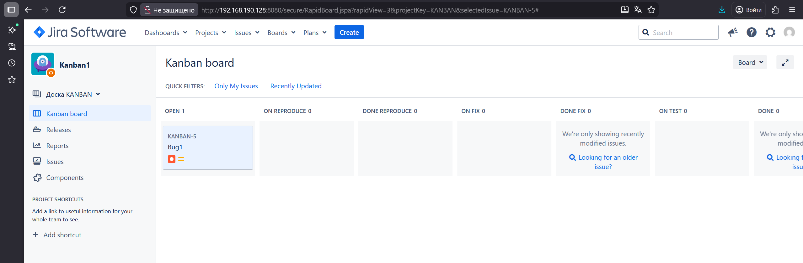
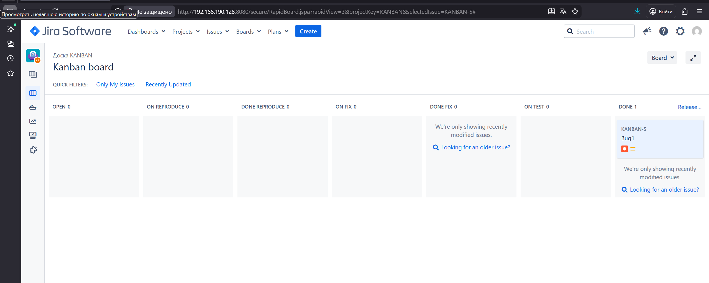
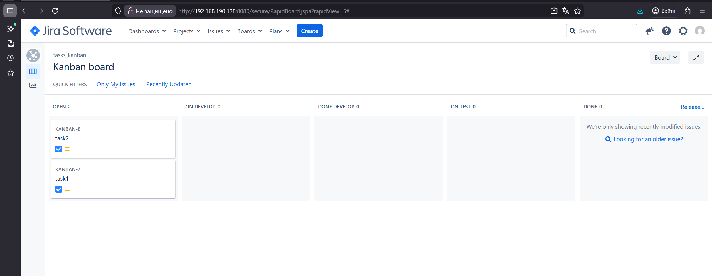
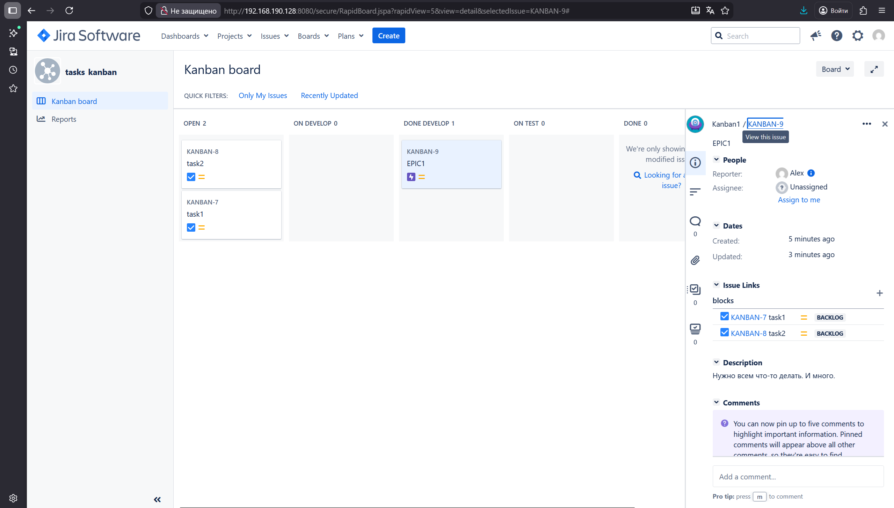
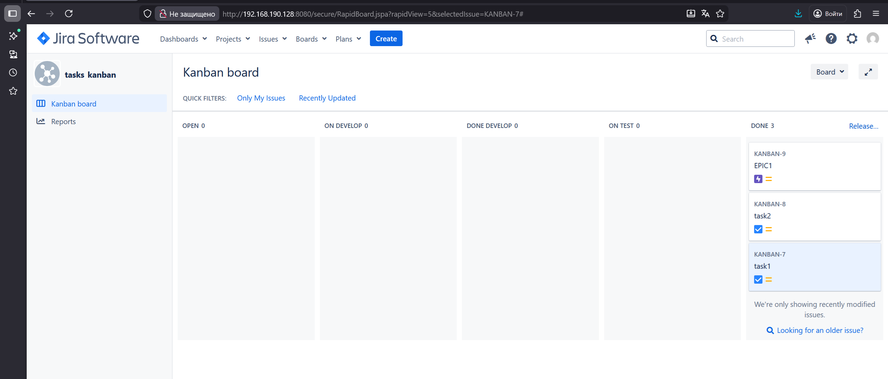
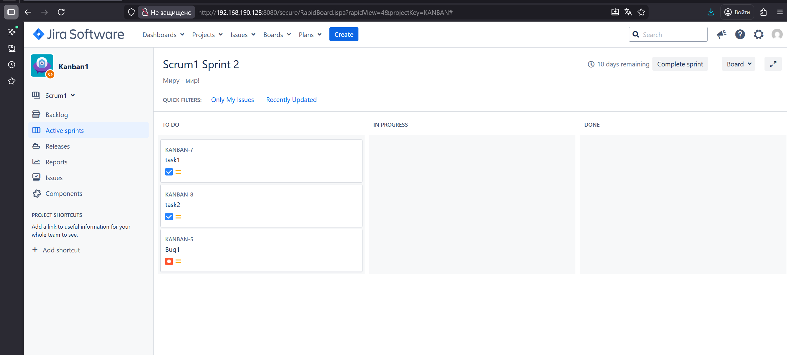
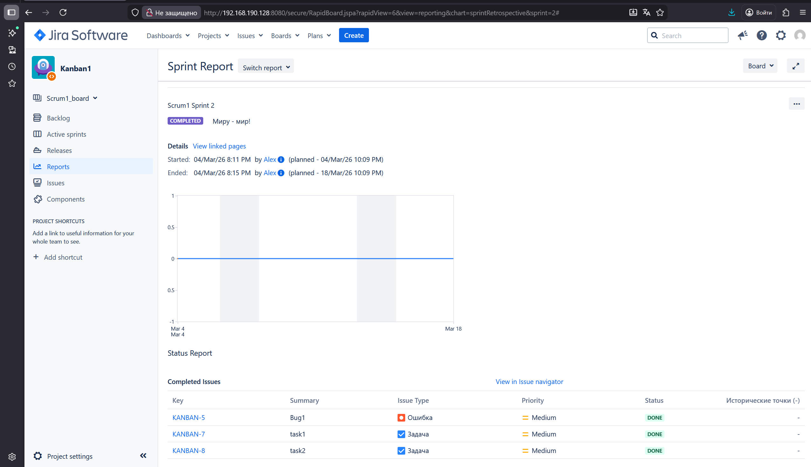

### Домашнее задание к занятию 7 «Жизненный цикл ПО» - Хрипун Алексей

После настройки Jira создается новый проект, а в нем задача типа bug. Доска по умолчанию не подходит (этапов больше), поэтому делаем свою:

Проводим задачу по разным этапам, просто перетаскивая ее по соответствующим колонкам:

Создаем две задачи типа task. Также проводим по всем этапам. Т.к. у этих задач набор этапов отличается от задачи bug, создаем новую доску Kanban, назначаем этим задачам метку (TEAM2) и на основе фильтра по метке размещаем эти задачи на другой доске:

Создаем задачу типа epic и привяжем к ней две предыдущие задачи:

 

Теперь в Scrum нужно запланировать новый спринт:

Также проводим задачи по всем этапам и закрываем спринт:

